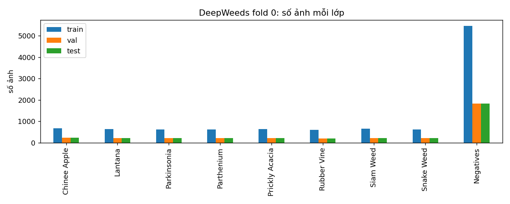
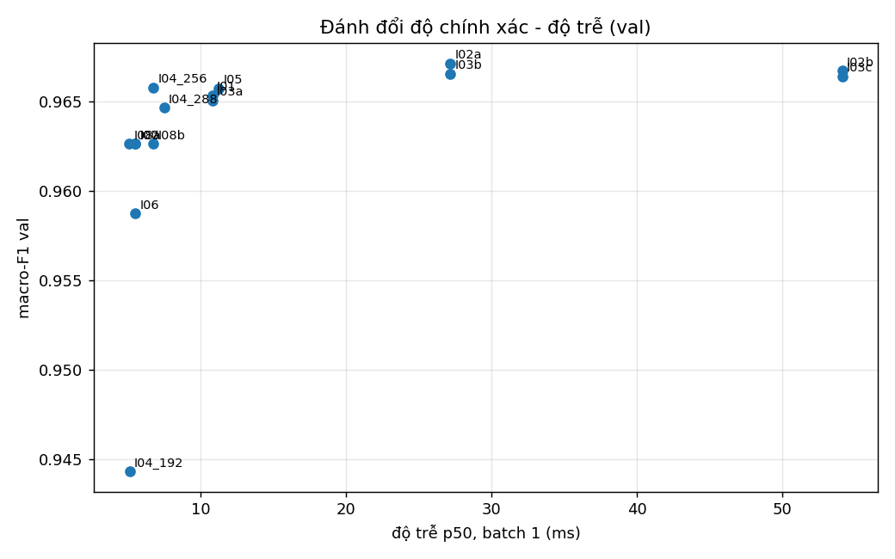
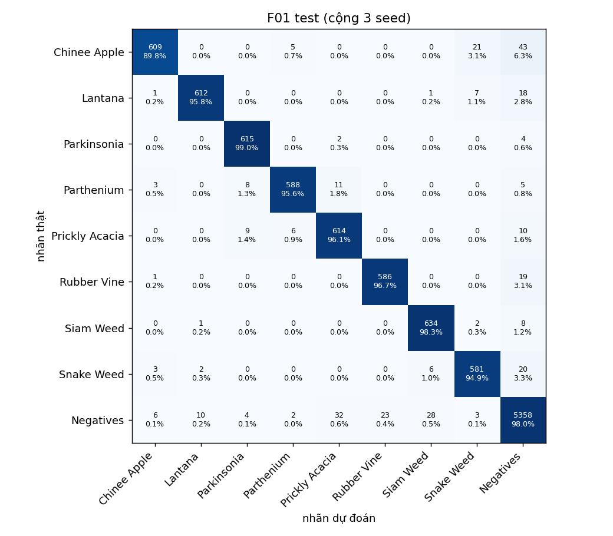

# Báo cáo Lab Day 2 — Backbone, công thức huấn luyện và suy luận trên DeepWeeds

Nguyễn Hoàng Sơn · 2A202602457 · Track 4, Day 2

Mọi con số dưới đây lấy từ `results.xlsx` (tạo bằng `code/experiments.py`), file dự đoán trong `predictions/` và
kết quả `eval.py` trong `eval_out/`. Mỗi `exp_id` truy ngược được tới log trong `logs/<exp_id>/seed<k>/`
(`config.json`, `history.csv`, `summary.json`) và ảnh `curves/<exp_id>_*.png`.

## 1. Tóm tắt

- **Bài toán:** phân loại 9 lớp DeepWeeds (17.509 ảnh, `Negative` ≈ 52%), fold 0 chia sẵn, chỉ số chính macro-F1.
- **Đã làm:** 6 backbone (B01–B06), 13 cấu hình công thức huấn luyện trên DeiT-S (T00–T12, 6 trục + 2 tổ hợp),
  16 cấu hình suy luận (I00–I08) có đo độ trễ p50/p95/p99, chung kết 3 seed và mốc 3 seed.
- **Cấu hình tốt nhất (chọn hoàn toàn trên val):** DeiT-S + TrivialAugment + CutMix + label smoothing 0.1,
  suy luận TTA 5 crop gộp xác suất + temperature scaling.
- **Test (3 seed, toàn bộ 3.507 ảnh):** **macro-F1 0.9614 ± 0.0040**, top-1 **0.9692 ± 0.0029**,
  ECE 0.0069 ± 0.0025; recall Chinee apple 89.8%, Snake weed 94.9%; p95 batch-1 = 26.8 ms (T4).
- **So với mốc** (công thức nền + 1 view): macro-F1 0.9584 ± 0.0010 → Δ = **+0.0029, nhỏ hơn std (0.0040): không
  phân biệt được với nhiễu seed**. Cải thiện rõ ràng nằm ở hiệu chuẩn (ECE 0.0116 → 0.0069) và F1 hai lớp khó.
- **Kết luận chính:** yếu tố quyết định là **chọn backbone + bộ trọng số tiền huấn luyện** (chênh tới 0.12 F1) và
  **khởi tạo ImageNet + tinh chỉnh toàn bộ** (+0.21 đến +0.27 F1); các thay đổi loss/augmentation/suy luận chỉ
  dịch chuyển cỡ ±0.005, cùng cỡ nhiễu seed.

## 2. Dữ liệu và thiết lập

**Chia dữ liệu (README 2.1)** — kiểm tra bằng `dataset.check_split` (log trong notebook, `eda/split_report.json`):

| Tập | Số ảnh | Tỉ lệ |
|---|---|---|
| train | 10.501 | 0.5997 |
| val | 3.501 | 0.2000 |
| test | 3.507 | 0.2003 |

Giao từng cặp tập theo `Filename` đều rỗng, hợp đúng 17.509 ảnh, không thiếu file. Đếm theo lớp khớp Table 1
của bài báo ở 7/9 lớp; Chinee apple đếm được 1.126 (bài báo 1.125) và Lantana 1.063 (bài báo 1.064): tổng không
đổi, có vẻ một ảnh được gán nhãn khác giữa CSV của tác giả và bảng trong bài báo. Tỉ lệ lớp lớn nhất/nhỏ nhất
trên train là **9.03** (`Negative` 5.463 so với Rubber vine 605).

Ảnh mẫu mỗi lớp: `eda/samples_per_class.png`. Bằng mắt, Chinee apple và Snake weed đều là cây lá xanh nhỏ mọc lẫn
cỏ khô, rất khó tách; `Negative` gồm cỏ, đất, cây bụi khác — đa dạng hơn nhiều so với từng loài.

**Kiểm tra pipeline (GUIDE 1.3)** — `eda/augmentation_check.png`, log trong notebook:

- loss CE ban đầu của head mới = **2.1835** (kỳ vọng ln 9 = 2.1972);
- overfit 8 ảnh: loss 2.20 → **0.0001** sau 60 bước;
- ảnh sau augmentation (giải chuẩn hoá) và CutMix khớp nhãn, λ tính theo diện tích hộp thật;
- 20 unit test tự viết (`code/tests_code.py`): focal γ=0 ≡ CE (sai số < 1e-6), label smoothing ≡ CE khi ε=0 và
  khớp `F.cross_entropy(label_smoothing=0.1)`, λ CutMix = tỉ lệ pixel giữ lại, gộp BN sai số < 1e-5 (kể cả
  `BatchNormAct2d` của timm), temperature scaling tìm lại đúng T đã biết, EMA, lịch LR, BN đóng băng ở eval mode,
  weight decay bằng 0 cho norm/bias, GMAC ResNet-50 ≈ 4.1.

**Công thức nền `T00`** (GUIDE 1.4): ImageNet pretrained, tinh chỉnh toàn bộ; train `RandomResizedCrop(224,
scale=(0.25,1))` + lật ngang (scale tối thiểu 0.25 thay vì 0.08 vì ảnh đã là cận cảnh, crop quá nhỏ dễ mất loài);
val/test resize 256 + center crop 224; chuẩn hoá theo `pretrained_cfg` của từng bộ trọng số; AdamW, LR backbone
1e-4 / head 1e-3, weight decay 0.05 (0 cho norm, bias), warmup 1 epoch + cosine theo bước, CE, batch 64,
**12 epoch**, AMP, chọn checkpoint theo macro-F1 val (hoà lấy epoch sớm hơn). Val loss luôn là CE thường để so
được giữa các loss.

**Phần cứng, phiên bản:** GPU NVIDIA Tesla T4 (16 GB); Python 3.13.15, torch 2.11.0+cu128, torchvision 0.26.0,
timm 1.0.29. B01–B06 và T00–T04 chạy trên Google Colab; do hết hạn mức GPU Colab, T05–T12 và chung kết chạy trên
Kaggle (cùng GPU T4, cùng phiên bản torch; trên Kaggle `num_workers = min(4, số nhân CPU)` thay vì 2 — chỉ ảnh hưởng thời
gian/epoch, không đổi công thức). Seed: 0 cho mọi thí nghiệm sàng lọc; 0, 1, 2 cho chung kết và mốc.
`cudnn.benchmark=True` nên kết quả không tái lập từng bit; độ lệch do GPU không tất định đo được bằng cặp B03/T00
(cấu hình giống hệt): 0.9581 so với 0.9588 (0.0007).

**Nhiễu seed:** 3 seed của mốc T00 cho macro-F1 val 0.9588 / 0.9642 / 0.9553 → **std 0.0045**; F01: std 0.0019.
Đây là thước đo để đọc mọi Δ một seed ở Bước 1–2.

## 3. So sánh backbone (sheet `Backbones`)

Cùng công thức nền, cùng seed 0, 12 epoch, 224 px. GMAC đếm bằng `torch.utils.flop_counter` (MAC = FLOPs/2),
độ trễ sơ bộ = p50 batch 1 FP32, 50 lần đo.

| exp | Backbone (tag timm) | Params (M) | GMAC | **macro-F1 val** | top-1 val | s/epoch | p50 b1 (ms) |
|---|---|---|---|---|---|---|---|
| B01 | resnet50.**a1_in1k** | 23.5 | 4.09 | 0.8372 | 0.8789 | 52.5 | 9.7 |
| B02 | convnext_tiny.fb_in1k | 27.8 | 4.46 | 0.9524 | 0.9643 | 60.5 | 5.9 |
| B03 | **deit_small_patch16_224.fb_in1k** | 21.7 | 4.24 | **0.9581** | **0.9700** | 48.5 | **5.4** |
| B04 | efficientnet_b0.ra_in1k | 4.0 | 0.39 | 0.8501 | 0.8832 | 47.4 | 11.5 |
| B05 | mobilenetv3_large_100.ra_in1k | 4.2 | 0.22 | 0.8328 | 0.8743 | 45.9 | 7.0 |
| B06 | resnet50.**tv2_in1k** | 23.5 | 4.09 | 0.9347 | 0.9509 | 50.6 | 8.2 |

Đường cong: `curves/B0*_*.png`.

Nhận xét:

1. **DeiT-S và ConvNeXt-T dẫn đầu và không phân biệt được** (Δ 0.006, một seed, std seed ≈ 0.0045). Chọn **DeiT-S**
   đi tiếp vì F1 val cao nhất, ít tham số nhất trong hai mạng, train nhanh nhất (48 s/epoch) và độ trễ batch-1 thấp
   nhất (5.4 ms) — tức là không phải đánh đổi gì.
2. **Bộ trọng số quan trọng ngang kiến trúc (slide trang 45).** B01 và B06 là *cùng* ResNet-50, *cùng* công thức tinh
   chỉnh, chỉ khác tag: `a1_in1k` (công thức "ResNet strikes back": BCE, augmentation rất mạnh) đạt 0.837, còn
   `tv2_in1k` đạt 0.935 (**+0.098**). Ba mạng thấp nhất (B01, B04, B05) đều dùng bộ trọng số `a1`/`ra` của timm;
   giả thuyết là các bộ trọng số này cần LR tinh chỉnh lớn hơn 1e-4 (xem ý 4). Vì vậy **thứ hạng ở đây không phải thứ hạng kiến trúc**; so sánh kiến trúc công
   bằng cần dò LR riêng cho mỗi bộ trọng số (chưa làm, xem Hạn chế).
3. **FLOPs không dự đoán độ trễ** (slide trang 43): EfficientNet-B0 chỉ 0.39 GMAC nhưng chậm nhất ở batch 1
   (11.5 ms — nhiều lớp depthwise/SE nhỏ, bị giới hạn bởi số kernel launch), DeiT-S 4.24 GMAC lại nhanh nhất
   (5.4 ms — vài phép matmul lớn, GPU tận dụng tốt). FLOPs cũng không dự đoán thời gian train: EfficientNet-B0 (10× ít GMAC hơn DeiT-S) chỉ
   nhanh hơn ~2% mỗi epoch — nhiều khả năng nút cổ chai là đọc và augmentation ảnh trên CPU (2 worker trên Colab).
4. Hội tụ: ConvNeXt đạt F1 val 0.93 ngay epoch 3, DeiT ở epoch 4; các mạng `a1`/`ra` (B01, B04, B05) tăng chậm và
   chững lại quanh 0.83–0.85 từ epoch 7 trong khi train loss vẫn cao (B01: 0.29 ở epoch 12) — dấu hiệu chưa khớp đủ
   (underfit) với LR 1e-4 khi cosine đã giảm LR. Không backbone nào quá khớp rõ rệt: val loss của cả 6 mạng giảm
   hoặc đi ngang đến epoch 12.

## 4. Công thức huấn luyện (sheet `Training`)

DeiT-S, seed 0, mỗi lần chạy khác `T00` đúng một yếu tố. Sau Bước 2 thử hai **tổ hợp tham lam** từ các yếu tố nhích
lên (T11, T12). Δ so với T00 = 0.9588; **std seed ≈ 0.0045**.

| exp | Trục | Khác T00 | macro-F1 val | Δ | Δ/σ | ECE val |
|---|---|---|---|---|---|---|
| T00 | nền | — | 0.9588 | — | — | 0.0095 |
| T01 | A khởi tạo | từ đầu (không pretrained) | 0.6842 | **−0.275** | −61 | 0.023 |
| T02 | A khởi tạo | đóng băng backbone, chỉ train head | 0.7474 | **−0.211** | −47 | 0.023 |
| T03 | C loss | label smoothing 0.1 | 0.9609 | +0.002 | +0.5 | **0.087** |
| T04 | C loss | focal γ=2 | 0.9551 | −0.004 | −0.8 | 0.050 |
| T05 | C loss | CE có trọng số lớp 1/n_c | 0.9486 | −0.010 | −2.3 | 0.012 |
| T06 | B augmentation | + ColorJitter | 0.9509 | −0.008 | −1.8 | 0.011 |
| T07 | B augmentation | + TrivialAugmentWide | 0.9603 | +0.002 | +0.3 | 0.012 |
| T08 | B augmentation | + CutMix α=1 | 0.9596 | +0.001 | +0.2 | 0.016 |
| T09 | D cân bằng mẫu | sampler cân bằng lớp | 0.9514 | −0.008 | −1.7 | 0.013 |
| T10 | F chính quy hoá | EMA 0.998 | 0.9587 | −0.000 | 0.0 | 0.009 |
| **T11** | tổ hợp | Trivial + CutMix + LS 0.1 | **0.9626** | +0.004 | +0.8 | 0.101 |
| T12 | tổ hợp | Trivial + CutMix + EMA | 0.9583 | −0.001 | −0.1 | 0.022 |

Đường cong: `curves/T*_*.png`. 6 trục (A, B, C, D, F + tổ hợp); trục loss và augmentation đều có ≥ 3 giá trị.

Phân tích:

- **Khởi tạo là yếu tố lớn nhất.** Từ đầu chỉ đạt 0.684 sau 12 epoch: ViT có thiên kiến quy nạp yếu (không có tính
  cục bộ, bất biến tịnh tiến) nên với ~10k ảnh và 12 epoch không học kịp (slide trang 32, 53). Đóng băng backbone
  đạt 0.747: đặc trưng ImageNet không đủ tách các loài cỏ gần giống nhau, cần tinh chỉnh toàn bộ (slide trang 51).
  Cả hai lệch hàng chục σ — chắc chắn không phải nhiễu.
- **Các cách bù mất cân bằng lớp đều không giúp, thậm chí hại** (T05 −2.3σ là chênh lệch duy nhất ngoài 2σ trong
  các thay đổi nhỏ; T09 −1.7σ; T04 −0.8σ). Chúng cũng **không** cải thiện F1 lớp hiếm: F1 Chinee apple T05 = 0.888,
  T09 = 0.914, focal 0.904 so với T00 0.923. Giải thích: với backbone tiền huấn luyện mạnh, các lớp loài cỏ (~600
  ảnh/lớp) đã đủ dữ liệu; tăng trọng số lớp hiếm làm mô hình đoán chúng nhiều hơn, tăng nhầm `Negative` → loài
  (giảm precision lớp hiếm) nhiều hơn phần recall lấy lại được. Sampler cân bằng còn làm mỗi epoch thấy lặp lại
  ảnh lớp hiếm ~9 lần và thấy ít ảnh `Negative` khác nhau hơn (đường cong T09 dao động mạnh ở epoch 2–8).
- **Label smoothing không đổi F1 nhưng làm hỏng hiệu chuẩn:** ECE 0.0095 → 0.087 (mô hình *kém tự tin*: nhãn mềm
  kéo xác suất max xuống ~0.9). Temperature scaling sửa được hoàn toàn (mục 5).
- **Augmentation:** TrivialAugment và CutMix mỗi cái +0.001–0.002 (< 0.5σ, không phân biệt được); ColorJitter −0.008
  (−1.8σ, nghi có hại: màu lá và màu đất là đặc trưng phân biệt loài, đổi màu mạnh làm mất tín hiệu này). CutMix
  có hợp với ảnh cỏ dại không? Ảnh DeepWeeds là cận cảnh với loài chiếm phần lớn khung hình nên cắt dán ít khi làm
  mất vật thể; CutMix không hại, nhưng nhiều khả năng 12 epoch là quá ngắn để augmentation mạnh phát huy (giả thuyết,
  chưa kiểm chứng bằng thí nghiệm dài hơn).
- **EMA trung tính** (Δ = −0.0001): với 12 epoch và cosine về 0, trọng số cuối đã "trơn" nên EMA không thêm gì.
- **Cộng dồn:** T11 (Trivial + CutMix + LS) = +0.0038, lớn hơn từng thành phần (+0.0015, +0.0008, +0.0021) —
  cộng dồn một phần, nhưng vẫn chỉ 0.8σ. T12 (thay LS bằng EMA) = −0.0006: LS góp phần chính trong T11, EMA không.
  Đã dùng **tham lam theo trục** (chọn yếu tố trên từng trục rồi ghép), thứ tự trục có thể ảnh hưởng kết quả.

## 5. Phương pháp suy luận (sheet `Inference`, `Latency`)

Trên **val**, mô hình chính = T11 seed 0 (tự chọn theo macro-F1 val trong T00, T11, T12). Độ trễ: GPU T4, warmup
10 lần, `torch.cuda.synchronize()` trước/sau, 100 lần đo, báo p50/p95/p99; **không tính tiền xử lý** (chỉ forward
trên tensor đã ở GPU); TTA đo thật K lượt forward. Thông lượng ở batch 32.

| exp | Phương pháp | K | macro-F1 val | ECE val | p50 / p95 / p99 b1 (ms) | ảnh/s b32 | Chi phí |
|---|---|---|---|---|---|---|---|
| I00 | 1 view (mốc) | 1 | 0.9626 | 0.101 | 5.5 / 5.7 / 6.0 | 250 | 1.0× |
| I01 | TTA lật, gộp xác suất | 2 | 0.9653 | 0.104 | 10.8 / 11.3 / 11.4 | 129 | 2.0× |
| I03a | TTA lật, gộp logit | 2 | 0.9650 | 0.103 | 10.8 / 11.3 / 11.4 | 129 | 2.0× |
| **I02a** | **5 crop, gộp xác suất** | 5 | **0.9671** | 0.107 | 27.1 / 27.5 / 28.5 | 52 | 4.9× |
| I03b | 5 crop, gộp logit | 5 | 0.9665 | 0.104 | 27.1 / 27.5 / 28.5 | 52 | 4.9× |
| I02b | 5 crop + lật (10 view) | 10 | 0.9667 | 0.107 | 54.1 / 54.8 / 55.1 | 26 | 9.8× |
| I04 | độ phân giải 192 px | 1 | 0.9443 | 0.103 | 5.1 / 5.6 / 5.9 | 352 | 0.9× |
| I04 | **độ phân giải 256 px** | 1 | 0.9658 | 0.094 | 6.8 / 7.0 / 7.1 | 197 | 1.2× |
| I04 | độ phân giải 288 px | 1 | 0.9646 | 0.089 | 7.5 / 7.8 / 8.3 | 147 | 1.4× |
| I05 | Ensemble T11 + ConvNeXt (B02) | 2 | 0.9657 | **0.058** | 11.2 / 11.8 / 13.2 | 113 | 2.0× |
| I06 | Trọng số EMA (T10, so với T00) | 1 | 0.9587 | 0.009 | = I00 | | 1.0× |
| **I07** | **Temperature scaling** T = 0.598 | 1 | 0.9626 | **0.005** | = I00 | | 1.0× |
| I08a | FP16 (`model.half()`) | 1 | 0.9626 | 0.101 | 5.1 / 8.9 / 10.2 | **1087** | 0.93× |
| I08b | AMP autocast | 1 | 0.9626 | 0.101 | **6.8** / 7.5 / 8.3 | 958 | 1.23× |
| I08c | Gộp BN vào conv (B06, 53 cặp) | 1 | không đổi | | 6.1 → **5.1** | | |

- **TTA** tăng +0.003 (lật) đến +0.005 (5 crop) F1 val với chi phí 2× đến 5×; 10 view không hơn 5 view. TTA không
  "miễn phí" (slide trang 66): lật ngang sửa đúng 16 ảnh nhưng làm sai 9 ảnh vốn đúng. Gộp xác suất nhỉnh hơn gộp
  logit một chút ở cả 3 cấu hình (≤ 0.0006, không phân biệt được).
- **Độ phân giải kiểm tra (FixRes, slide trang 68):** 256 px (+0.003) gần bằng TTA 5 crop với 1.2× chi phí; 192 px
  giảm 0.018. Train bằng `RandomResizedCrop` làm vật thể trông *to hơn* lúc train so với center crop lúc test, nên
  test ở độ phân giải cao hơn bù lại; ở đây ảnh gốc chỉ 256 px nên 288 px là phóng to, không thêm thông tin.
- **Ensemble** với ConvNeXt không hơn TTA về F1 nhưng hiệu chuẩn tốt nhất trong các cách không dùng T (ECE 0.058).
- **Hiệu chuẩn:** T = 0.598 (< 1: làm xác suất *sắc hơn*, đúng với mô hình LS kém tự tin) khớp trên val; ECE cross-fit
  hai nửa val 0.101 → **0.005**, accuracy không đổi. Trên test: 0.1005 → **0.0069** (mục 6).
- **FP16/AMP:** cả hai không đổi nhãn ảnh nào so với FP32. Ở batch 1, **AMP chậm hơn FP32** (6.8 so với 5.5 ms) vì chi
  phí chèn phép ép kiểu lớn hơn phần tính toán tiết kiệm được (slide trang 73); FP16 thuần nhanh p50 nhưng p95
  dao động. Ở batch 32, FP16 tăng thông lượng **4.3×** (250 → 1087 ảnh/s) nhờ Tensor Core.
- **Gộp BN** (thử trên ResNet-50 B06 vì DeiT/ConvNeXt dùng LayerNorm): sai số lớn nhất 2.9e-6, F1 không đổi, p50
  6.1 → 5.1 ms (−16%).
- **Ngoại tuyến hay thời gian thực:** dữ liệu ủng hộ kết luận của slide: TTA/ensemble chỉ đáng dùng ngoại tuyến;
  trên robot nên dùng thứ gần như miễn phí (temperature scaling, độ phân giải đã dò, FP16 khi xử lý theo lô, gộp BN
  với CNN). Tuy vậy với DeiT-S trên T4, ngay cả 5 crop (p95 27.5 ms) vẫn nằm trong ngân sách 30–100 ms.

## 6. Cấu hình tốt nhất và kết quả test (sheet `Final`, `PerClass`)

**F01** (mô tả đủ để tái lập): `deit_small_patch16_224.fb_in1k`, tinh chỉnh toàn bộ; train `RandomResizedCrop(224,
scale=(0.25,1))` + lật ngang + `TrivialAugmentWide` + CutMix α=1 (λ theo diện tích thật) + CE label smoothing 0.1;
AdamW, LR backbone 1e-4 / head 1e-3, wd 0.05 (0 cho norm/bias), warmup 1 epoch + cosine, batch 64, 12 epoch, AMP;
chọn checkpoint theo macro-F1 val. Suy luận: resize 256 (giữ nguyên ảnh), 5 crop 224 (4 góc + giữa), trung bình
softmax, rồi temperature scaling với T khớp trên val của từng seed (T = 0.580 / 0.585 / 0.591). Lệnh:
`Config(exp_id="F01", backbone="deit_small", aug="trivial", mix="cutmix", loss="ls", label_smoothing=0.1)` +
`experiments.finalize("F01", ..., method="crop5", space="prob", temperature=True)`.

Quy trình: cấu hình chốt **trên val** trước khi chạy test; F01 và mốc T00 mỗi cái 3 seed; **test chạy đúng một lần
mỗi seed** (`finalize` từ chối ghi đè file test đã có). Số liệu dưới đây là kết quả `eval.py score/grade`, đã chạy
lại cục bộ trên `predictions/` và khớp.

| Cấu hình (3 seed) | macro-F1 val | **macro-F1 test** | **top-1 test** | balanced acc | ECE test |
|---|---|---|---|---|---|
| **F01** | 0.9640 ± 0.0019 | **0.9614 ± 0.0040** | **0.9692 ± 0.0029** | 0.9603 ± 0.0030 | **0.0069 ± 0.0025** |
| F01 chưa temperature scaling | — | 0.9614 ± 0.0040 | 0.9692 ± 0.0029 | 0.9603 | 0.1005 ± 0.0015 |
| Mốc T00 + I00 | 0.9594 ± 0.0045 | 0.9584 ± 0.0010 | 0.9681 ± 0.0008 | 0.9594 ± 0.0021 | 0.0116 ± 0.0016 |
| Δ F01 − mốc | | **+0.0029** | +0.0011 | | −0.0047 |

Theo lớp (test, mean ± std 3 seed; đầy đủ trong sheet `PerClass`):

| Lớp | F01 precision | F01 recall | F01 F1 | Mốc F1 |
|---|---|---|---|---|
| **Chinee apple** | 0.978 ± 0.003 | **0.898 ± 0.004** | 0.936 | 0.923 |
| **Snake weed** | 0.946 ± 0.014 | **0.949 ± 0.006** | 0.948 | 0.928 |
| Prickly acacia | 0.932 | 0.961 | 0.946 | 0.942 |
| Negative | 0.977 | 0.980 | 0.979 | 0.980 |
| (5 lớp còn lại) | | | 0.965–0.979 | 0.965–0.985 |

So với bài báo (*trích dẫn*, điều kiện khác: ~100 epoch, augmentation mạnh, 5 fold): ResNet-50 95.7% weighted
accuracy, recall Chinee 88.5%, Snake 88.8%. F01 đạt top-1 96.9% và recall Chinee 89.8%, Snake 94.9% sau 12 epoch;
so sánh chỉ mang tính tham khảo vì định nghĩa accuracy và số fold khác nhau. Chênh macro-F1 val/test của F01 chỉ
0.0027 nên không có dấu hiệu chọn quá khớp với val.

**Tự chấm phần I** (`eval_out/grade_I.json`, ngưỡng tạm thời): I1 7/7, **I2 2/5** (Δ = +0.0029 ≤ s = 0.0040),
I3 4/4, I4a 1/1, I4b 1/1, I5 2/2 → **17/20**.

**Phân tích lỗi** (ma trận nhầm lẫn cộng 3 seed, `eval_out/confusion_F01.png`):

- Lỗi nhiều nhất của các loài là **bị đoán thành `Negative`** (Chinee 43, Snake 20, Rubber vine 19, Lantana 18 trên
  3 × ~210 ảnh) và ngược lại `Negative` bị đoán thành loài (Prickly acacia 32, Siam weed 28, Rubber vine 23).
  `Negative` là "mọi thứ khác", nên ảnh có loài chỉ chiếm phần nhỏ khung hình hoặc ảnh nền giống tán lá dễ nhầm.
- **Cặp Chinee apple → Snake weed:** 21 ảnh (3.1%; mốc 35 ảnh, 5.2% — bài báo 3.4%); chiều ngược lại chỉ 3 ảnh
  (mốc 13). F01 giảm rõ cặp nhầm này, là nguồn chính của tăng F1 hai lớp khó.
  Xem ảnh `eval_out/err_chinee_as_snake.png`: các ca sai tự tin nhất là tán lá rậm, rối, chụp ngược sáng hoặc trong
  bóng râm, lá nhỏ hình bầu dục lẫn trong cỏ khô — ở 224 px gần như không còn thấy gân lá và mép lá, là chi tiết
  phân biệt hai loài. **Giả thuyết:** thông tin phân biệt nằm ở kết cấu chi tiết nhỏ bị mất khi crop/resize; ủng hộ
  bởi việc độ phân giải 256 px và TTA nhiều crop đều giúp, và bởi việc bài báo đạt kết quả tốt với ảnh đầy đủ.
- Parthenium → Prickly acacia (11), Prickly acacia → Parkinsonia (9), Parthenium → Parkinsonia (8): các loài có lá
  xẻ/lá kép nhỏ, ở 224 px hình dạng lá rất giống nhau.

Hai cấu hình đề xuất: **tốt nhất ngoại tuyến** = F01 (5 crop + TS, p95 26.8 ms batch 1, đo trên mô hình chung kết);
**rẻ nhất cho thời gian thực** = cùng mô hình, 1 view ở 256 px + TS (~7 ms; F1 val 0.9658 một seed, chưa chạy test
nên không báo số test).

## 7. Kết luận và khuyến nghị

- **Cấu hình tốt nhất:** F01 — macro-F1 test 0.9614 ± 0.0040, top-1 0.9692 ± 0.0029. Tốt hơn mốc +0.0029 macro-F1,
  **không vượt nhiễu seed** (std 0.0040); vượt rõ ở hiệu chuẩn (ECE −40%) và F1 hai lớp khó (+0.013, +0.020).
- **Yếu tố đóng góp nhiều nhất:** (1) **chọn backbone/bộ trọng số tiền huấn luyện** — 0.83 đến 0.96 F1 val, riêng
  tag trọng số của ResNet-50 đã 0.098; (2) **khởi tạo pretrained + tinh chỉnh toàn bộ** — +0.21 đến +0.27;
  (3) công thức huấn luyện và suy luận — mỗi thứ ≤ +0.005, cùng cỡ nhiễu; giá trị lớn nhất của chúng là hiệu chuẩn
  (temperature scaling) chứ không phải accuracy.
- **Triển khai trên robot, ngân sách 30–100 ms/khung:** DeiT-S (21.7 M params) + 1 view ở 256 px + temperature
  scaling (~7 ms trên T4); nếu còn ngân sách, TTA lật hoặc 5 crop (11–27 ms). Trên phần cứng nhúng (Jetson) cần đo
  lại: độ trễ trên T4 không chuyển thẳng sang thiết bị khác, và nên xuất ONNX/TensorRT + FP16. Giữ temperature
  scaling để dùng ngưỡng tin cậy (ví dụ chỉ phun thuốc khi xác suất loài > 0.9).

## 8. Hạn chế và việc tiếp theo

- **Một fold, chia ngẫu nhiên, không theo địa điểm:** ảnh cùng địa điểm/thời điểm có thể nằm ở cả train và test, nên
  điểm test có thể lạc quan so với khi gặp địa điểm, mùa, ánh sáng mới. Temperature T khớp trên val cũng có thể không
  còn đúng khi lệch miền.
- **Sàng lọc một seed:** Bước 1–2 chỉ 1 seed; std seed đo được (0.0045) cho thấy hầu hết Δ của Bước 2 nằm trong nhiễu.
  Kết luận "có hại" cho trọng số lớp (−2.3σ) cũng chỉ là một seed.
- **12 epoch** (bài báo ~100): augmentation mạnh (CutMix, Trivial) và các bộ trọng số `a1`/`ra` chưa hội tụ; chưa dò
  LR riêng cho từng bộ trọng số, nên so sánh backbone thiên vị bộ trọng số dễ tinh chỉnh với LR 1e-4.
- **Tham lam theo trục:** chưa thử mọi tổ hợp; thứ tự trục có thể đổi kết quả. Một số trục (LR/optimizer, độ phân
  giải train, số epoch) chưa thử.
- **Đổi môi trường giữa chừng** (Colab → Kaggle, cùng T4 và torch 2.11): thời gian/epoch giữa hai nhóm thí nghiệm
  không so sánh trực tiếp được (số worker khác nhau).
- **Độ trễ** đo trên T4, không tính tiền xử lý, không phải phần cứng robot.
- Tiếp theo: chạy đủ 5 fold cho F01; 3 seed cho các yếu tố Bước 2 có |Δ| > σ; dò LR cho ResNet/EfficientNet; train
  lâu hơn (30–50 epoch) để augmentation mạnh phát huy; chưng cất DeiT-S → MobileNetV3 cho robot; đánh giá trên ảnh
  làm tối/mờ để kiểm tra độ bền và hiệu chuẩn khi lệch miền.

## 9. Phụ lục

- Danh sách `exp_id` và cấu hình đầy đủ: sheet `Backbones`, `Training`, `Inference` của `results.xlsx`;
  `logs/<exp_id>/seed<k>/config.json` (mọi siêu tham số + phiên bản thư viện), `logs/summary_all.csv`.
- Kiểm tra dữ liệu: `eda/split_report.json`, `eda/*.png`.
- Notebook và cách chạy lại: xem `README.md`.
